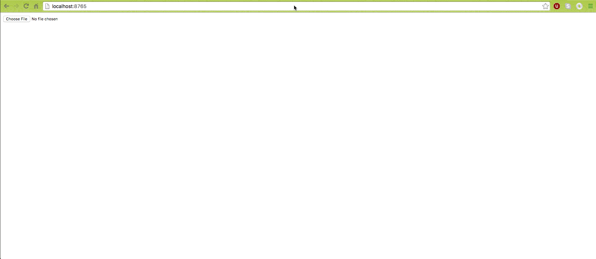

# Photo mosaic
# ------------

is a javascript application that will slice an image loaded into tiles,
calculate the average color per slice and composite the result on photomosaic
of the original image.

# prerequisite

Have [Node] (https://nodejs.org/en/download/) installed.

# install

With [npm](https://www.npmjs.com/) do:

```
npm install
```

```
npm install browserify -g
```

# getting started

```
browserify js/client.js -o js/bundle.js
```

```
node server.js
```

# usage

hit on the browser

```
http://localhost:8765
```

you can configure the tile size by changing mosaic.js file.

# result



# third-party dependencies

* `'browserify'`
* `'webworkify'`
